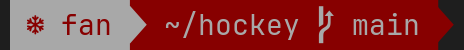
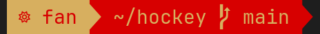
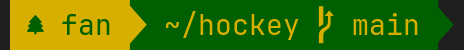
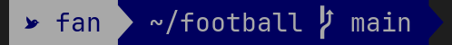
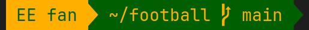
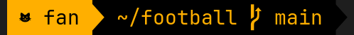

# Sports Team Oh My Zsh Prompt Themes

A collection of Oh My Zsh prompt themes in the colours of professional sports teams. Show your team spirit right in your terminal!

## Overview

Themes are grouped by league, one folder per league and one folder per team inside it. Each theme uses the team's colours and a Nerd Font icon in your zsh prompt. Every NHL and CFL team is covered today; more leagues are welcome.

## Themes

### NHL

Rendered with JetBrains Mono Nerd Font on a dark background.

| Team | File | Preview |
|---|---|---|
| Colorado Avalanche | `nhl/avalanche/avalanche-current.zsh-theme` |  |
| Chicago Blackhawks | `nhl/blackhawks/blackhawks-current.zsh-theme` |  |
| Columbus Blue Jackets | `nhl/blue-jackets/blue-jackets-current.zsh-theme` |  |
| St. Louis Blues | `nhl/blues/blues-current.zsh-theme` |  |
| Boston Bruins | `nhl/bruins/bruins-current.zsh-theme` |  |
| Montreal Canadiens | `nhl/canadiens/canadiens-current.zsh-theme` |  |
| Vancouver Canucks | `nhl/canucks/canucks-current.zsh-theme` |  |
| 1980s Vancouver Canucks | `nhl/canucks/canucks-retro.zsh-theme` |  |
| Washington Capitals | `nhl/capitals/capitals-current.zsh-theme` |  |
| New Jersey Devils | `nhl/devils/devils-current.zsh-theme` |  |
| Anaheim Ducks | `nhl/ducks/ducks-current.zsh-theme` |  |
| Calgary Flames | `nhl/flames/flames-current.zsh-theme` |  |
| Calgary Flames | `nhl/flames/flames-retro.zsh-theme` |  |
| Philadelphia Flyers | `nhl/flyers/flyers-current.zsh-theme` |  |
| Vegas Golden Knights | `nhl/golden-knights/golden-knights-current.zsh-theme` |  |
| Carolina Hurricanes | `nhl/hurricanes/hurricanes-current.zsh-theme` |  |
| New York Islanders | `nhl/islanders/islanders-current.zsh-theme` |  |
| Winnipeg Jets | `nhl/jets/jets-current.zsh-theme` |  |
| LA Kings | `nhl/kings/kings-current.zsh-theme` |  |
| LA Kings Retro | `nhl/kings/kings-retro.zsh-theme` |  |
| Seattle Kraken | `nhl/kraken/kraken-current.zsh-theme` |  |
| Tampa Bay Lightning | `nhl/lightning/lightning-current.zsh-theme` |  |
| Utah Mammoth | `nhl/mammoth/mammoth-current.zsh-theme` |  |
| Toronto Maple Leafs | `nhl/maple-leafs/maple-leafs-current.zsh-theme` |  |
| Edmonton Oilers | `nhl/oilers/oilers-current.zsh-theme` |  |
| Edmonton Oilers | `nhl/oilers/oilers-retro.zsh-theme` |  |
| Florida Panthers | `nhl/panthers/panthers-current.zsh-theme` |  |
| Pittsburgh Penguins | `nhl/penguins/penguins-current.zsh-theme` |  |
| Nashville Predators | `nhl/predators/predators-current.zsh-theme` |  |
| New York Rangers | `nhl/rangers/rangers-current.zsh-theme` |  |
| Detroit Red Wings | `nhl/red-wings/red-wings-current.zsh-theme` |  |
| Buffalo Sabres | `nhl/sabres/sabres-current.zsh-theme` |  |
| Ottawa Senators | `nhl/senators/senators-current.zsh-theme` |  |
| San Jose Sharks | `nhl/sharks/sharks-current.zsh-theme` |  |
| Dallas Stars | `nhl/stars/stars-current.zsh-theme` |  |
| Minnesota Wild | `nhl/wild/wild-current.zsh-theme` |  |

### CFL

Rendered with JetBrains Mono Nerd Font on a dark background.

| Team | File | Preview |
|---|---|---|
| Montreal Alouettes | `cfl/alouettes/alouettes-current.zsh-theme` |  |
| Toronto Argonauts | `cfl/argonauts/argonauts-current.zsh-theme` |  |
| Winnipeg Blue Bombers | `cfl/blue-bombers/blue-bombers-current.zsh-theme` |  |
| Edmonton Elks | `cfl/elks/elks-current.zsh-theme` |  |
| BC Lions | `cfl/lions/lions-current.zsh-theme` |  |
| Ottawa Redblacks | `cfl/redblacks/redblacks-current.zsh-theme` |  |
| Saskatchewan Roughriders | `cfl/roughriders/roughriders-current.zsh-theme` |  |
| Calgary Stampeders | `cfl/stampeders/stampeders-current.zsh-theme` |  |
| Hamilton Tiger-Cats | `cfl/tiger-cats/tiger-cats-current.zsh-theme` |  |

## Installation

To use these themes, you need to have [Oh My Zsh](https://ohmyz.sh/) installed. If you haven't installed it yet, follow the instructions on their website.

### Installing Custom Oh My Zsh Themes

1. Clone this repository:

   ```
   git clone https://github.com/sryanb/ohmyzsh-sports-themes.git
   ```

2. Copy the theme files to your Oh My Zsh custom themes directory:

   ```
   cp -r ohmyzsh-sports-themes/[league]/[yourteam]/ ~/.oh-my-zsh/custom/themes/
   ```

3. Open your `~/.zshrc` file in a text editor.

4. Set the `ZSH_THEME` variable to the name of the theme you want to use. For example:

   ```
   ZSH_THEME="oilers/oilers-current"
   ```

5. Save the file and restart your terminal or run:
   ```
   source ~/.zshrc
   ```

## Customization

Feel free to modify the themes to your liking. Each theme file is a zsh script that defines how your prompt looks. You can edit colors, add information, or change the layout.

## Contributing

Contributions are welcome! If you'd like to add a theme for your favorite team, add a new league, or improve an existing theme, please submit a pull request.

## License

This project is licensed under the MIT License - see the [LICENSE](LICENSE) file for details.

## Acknowledgments

- Thanks to the [Oh My Zsh](https://ohmyz.sh/) project for making terminal customization fun and easy.
- Inspired by the passion of sports fans everywhere.

Enjoy your team-themed terminal experience!
